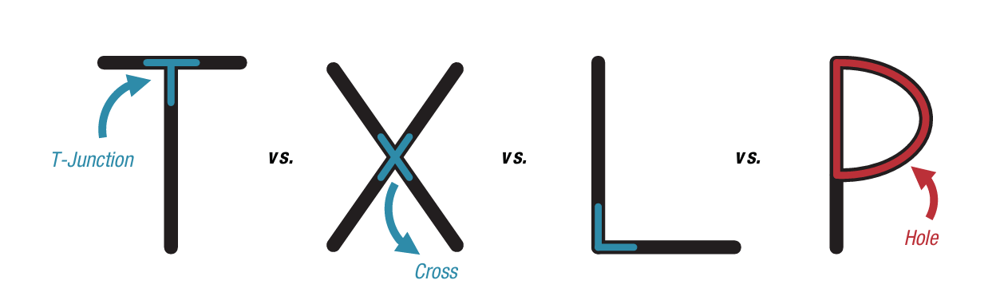
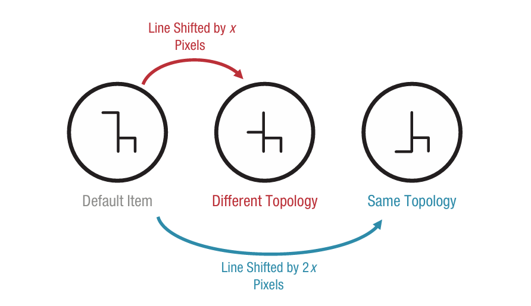
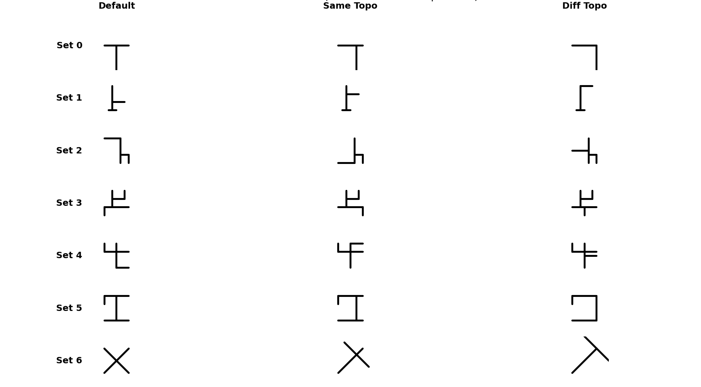
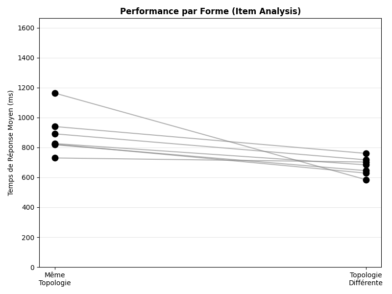
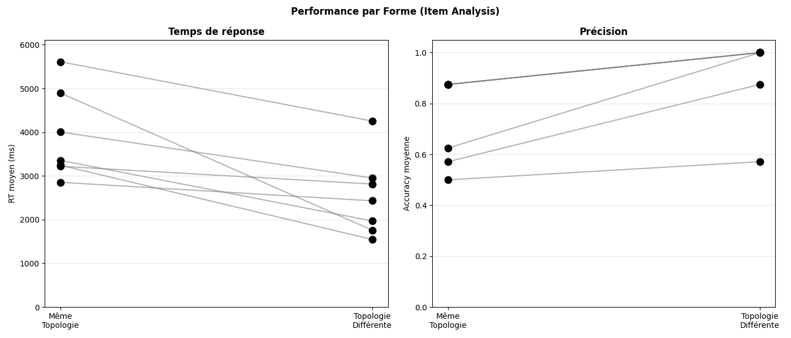
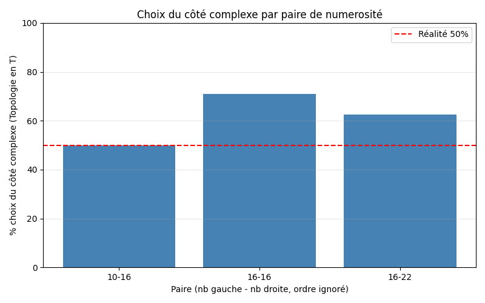

# Perceiving Topological Relations <!-- omit in toc -->

Lien page : https://romeodelyon69.github.io/HSS51H05-Romeo-NAZARET/

Lien github : https://github.com/romeodelyon69/HSS51H05-Romeo-NAZARET

Ce dépôt contient une réplication des expériences présentées dans l'article **"Perceiving Topological Relations"** de Yousif & Brannon (2025).

L'étude originale postule que les relations topologiques (telles que les jonctions en T, les croisements ou les trous) constituent des primitives visuelles fondamentales. L'hypothèse centrale est que ces propriétés sont perçues rapidement et automatiquement par le système visuel, indépendamment des détails euclidiens précis.

## Table des matières <!-- omit in toc -->
- [Présentation de l'article](#présentation-de-larticle)
- [Préparation des stimuli](#préparation-des-stimuli)
- [Structure du Projet](#structure-du-projet)
- [Installation et utilisation](#installation-et-utilisation)
- [Analyse des résultats](#analyse-des-résultats)
  - [Expérience 1](#expérience-1)
  - [Expérience 2](#expérience-2)
  - [Expérience 3](#expérience-3)
- [Remerciements](#remerciements)


## Présentation de l'article  

Dans cet article, Yousif & Brannon cherchent à démontrer le postulat suivant : les humains perçoivent les relations topologiques de manière rapide et automatique contrairement aux propriétés euclidiennes (angles, distances, tailles,...). 

Exemple de topologie :
 

Pour démontrer cela, les auteurs ont mis en place plusieurs expériences : 
* La première expérience consiste à déterminer si deux formes sont identiques ou non. L'idée est d'afficher des formes similaires partageant ou non la même topologie, et de mesurer le temps que le participant met pour les différencier. L'objectif est de mettre en avant le fait que nous sommes plus efficaces pour différencier deux formes présentant des topologies différentes. Afin de limiter les biais, les stimuli sont disposés aléatoirement dans 6 positions possibles jamais 2 fois au même endroit d'affilée. 
* Dans la deuxième expérience, il s'agit de trouver une forme parmi d'autres similaires à nouveau partageant ou non la même topologie. A nouveau, l'idée est de montrer qu'il est à al fois plus simple et plus rapide de discriminer deux formes qui présentes des différences de topologie plutôt que de simples différences géométriques.
* Enfin, pour la troisième expérience, le participant doit déterminer parmi deux lots de formes lequel contient le plus de lignes. L'objectif ici est de montrer que la topologie "T" apparaît comme plus complexe et possédant plus de lignes que la topologie "L".  


## Préparation des stimuli 

La construction des différents stimuli est essentielle pour l'expérience. L'idée est la suivante, pour une forme de base, on en construit deux versions : une partageant la même topologie générale, et une avec une topologie différente. 

Exemple : 


Afin de varier les formes présentées au cours d'une même expérience, j'ai réalisé $7$ différentes formes de base ainsi que leurs $2$ variations à chaque fois. 

Voici les stimuli créés : 



## Structure du Projet

```text
.
├── data/                   # Dossier de sortie pour les fichiers de logs (.xpd)
├── gen_stimuli.py          # Module de génération procédurale des stimuli (T, L, jonctions)
├── Experience1-b.py        # Script de l'Expérience 1b (Comparaison Rapide)
├── Experience2.py          # Script de l'Expérience 2 (Recherche Visuelle)
├── Experience3.py          # Script de l'Expérience 3 (Comparaison de Nombres)
├── analyseExp1.py          # Script d'analyse et graphiques pour Exp 1b
├── analyseExp2.py          # Script d'analyse et graphiques pour Exp 2
├── analyseExp3.py          # Script d'analyse et graphiques pour Exp 3
├── requirements.txt        # Liste des dépendances Python
└── README.md               # Documentation du projet
```


## Installation et utilisation

1. Cloner le repo :
```bash
git clone https://github.com/romeodelyon69/HSS51H05-Romeo-NAZARET.git
cd HSS51H05-Romeo-NAZARET
```
2. Installer les requirements :
```bash
pip install expyriment pandas numpy pyautogui matplotlib
```
3. Pour lancer les expériences :
* Experience 1 : 
```
python Experience1-b.py
```
* Experience 2 : 
```
python Experience2.py
```
* Experience 3 : 
```
python Experience3.py
```


## Analyse des résultats 
Pour lancer les analyses :
* Experience 1 : 
```
python analyseExp1.py
```
* Experience 2 : 
```
python analyseExp2.py
```
* Experience 3 : 
```
python analyseExp3.py
```
### Expérience 1 

L'objectif de cette expérience est de montrer qu'il est plus rapide de percevoir des différences entre deux formes avec des topologies différentes. Cela semble corroboré par les résultats que j'ai pu obtenir : 



On voit clairement que, au sein d'un même set de forme, le temps nécessaire pour effectuer la différentiation est nettement inférieur quand la topologie n'est pas la même. 

### Expérience 2 

A nouveau, l'objectif est de mettre en avant le fait qu'il est plus facile pour le cerveau de percevoir des différences entre deux formes ne partageant pas la même topologie. Ce postulat se retrouve bien dans les résultats de l'expérience : 



A nouveau, une topologie différente rend la recherche plus rapide et plus fiable. 

### Expérience 3

Enfin, l'idée est ici de montrer que la topologie "T" est perçue comme ayant plus de lignes / est plus complexe que la topologie "L". Cela semble logique puisque le "L" est topologiquement équivalent à $1$ ligne tandis que le "T" à $2$. L'expérience montre bien cela. En effet, on peut voir que les participants désignent plus souvent le lot de forme en "T" que celui en "L", même s'il y en a autant voire plus. 



Normalement, si les deux topologies étaient perçues de la même manière, on devrait observer $50$% pour chaque catégorie. Ainsi, on observe clairement que la différence de topologie joue un rôle essentiel. 

## Remerciements

Je tiens à remercier mes camarades de la section badminton qui ont gentiment accepté de se prêter aux différentes expériences. 